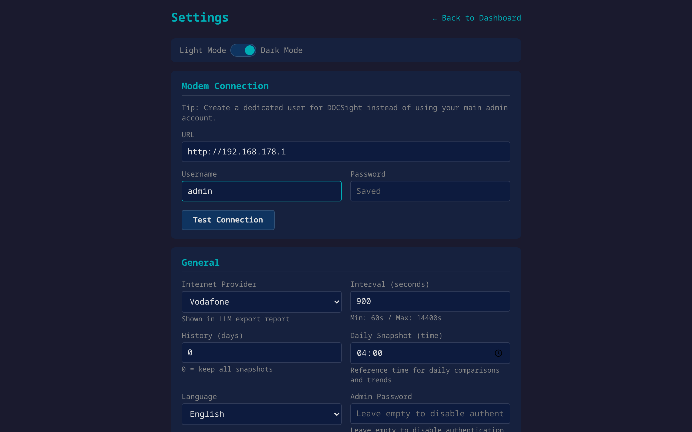

# Installation Guide

Get DOCSight running in under 10 minutes. No programming knowledge required.

## Table of Contents

- [Step 1: Install Docker](#step-1-install-docker)
- [Step 2: Start DOCSight](#step-2-start-docsight)
- [Step 3: First-Time Setup](#step-3-first-time-setup)
- [Updating DOCSight](#updating-docsight)
- [Troubleshooting](#troubleshooting)
- [Uninstalling](#uninstalling)

---

## Step 1: Install Docker

Docker runs applications in isolated "containers" — think of it as a lightweight virtual machine. DOCSight runs inside one of these containers.

**Already have Docker?** [Skip to Step 2 →](#step-2-start-docsight)

<details>
<summary><h3>🪟 Windows</h3></summary>

1. Download [Docker Desktop for Windows](https://www.docker.com/products/docker-desktop/)
2. Run the installer and follow the prompts
3. When asked, enable **WSL 2** (recommended) or Hyper-V
4. Restart your computer when prompted
5. Open Docker Desktop — wait until the status indicator turns green ("Engine running")

> **Requirements:** Windows 10 (64-bit, version 2004+) or Windows 11. Docker Desktop is free for personal use.

To verify: Open **PowerShell** or **Command Prompt** and type:
```
docker --version
```
You should see something like `Docker version 27.x.x`.

</details>

<details>
<summary><h3>🍎 macOS</h3></summary>

1. Download [Docker Desktop for Mac](https://www.docker.com/products/docker-desktop/)
   - **Apple Silicon (M1/M2/M3/M4):** Download the "Apple Silicon" version
   - **Intel Mac:** Download the "Intel chip" version
2. Open the `.dmg` file and drag Docker to your Applications folder
3. Open Docker from Applications — allow it when macOS asks for permissions
4. Wait until the whale icon in the menu bar stops animating ("Engine running")

To verify: Open **Terminal** and type:
```
docker --version
```

</details>

<details>
<summary><h3>🐧 Linux</h3></summary>

Most Linux distributions have Docker in their package manager.

**Ubuntu / Debian:**
```bash
sudo apt update
sudo apt install docker.io docker-compose-plugin
sudo systemctl enable --now docker
sudo usermod -aG docker $USER
```
Log out and back in for the group change to take effect.

**Arch / CachyOS / Manjaro:**
```bash
sudo pacman -S docker docker-compose
sudo systemctl enable --now docker
sudo usermod -aG docker $USER
```
Log out and back in.

**Fedora:**
```bash
sudo dnf install docker docker-compose-plugin
sudo systemctl enable --now docker
sudo usermod -aG docker $USER
```
Log out and back in.

To verify:
```bash
docker --version
```

</details>

<details>
<summary><h3>📦 Synology NAS (DSM 7.2+)</h3></summary>

1. Open **Package Center** on your Synology NAS
2. Search for **Container Manager** and click **Install**
3. Once installed, open **Container Manager** from the main menu

That's it! You'll use Container Manager in Step 2.

> **Older DSM (< 7.2)?** Look for "Docker" instead of "Container Manager" in Package Center.

</details>

<details>
<summary><h3>🟠 Unraid</h3></summary>

Docker is built into Unraid. To enable it:

1. Go to **Settings → Docker** in the Unraid WebGUI
2. Set **Enable Docker** to **Yes**
3. Click **Apply**

You'll use the Unraid Docker UI in Step 2.

</details>

---

## Step 2: Start DOCSight

Choose the method that fits your setup. All methods create the same container.

<details>
<summary><h3>💻 Terminal (Windows, Mac, Linux)</h3></summary>

Open a terminal:
- **Windows:** PowerShell or Command Prompt
- **Mac:** Terminal (Applications → Utilities)
- **Linux:** Your terminal emulator

Run this command:

```bash
docker run -d \
  --name docsight \
  --restart unless-stopped \
  -p 8765:8765 \
  -v docsight_data:/data \
  ghcr.io/itsdnns/docsight:latest
```

> **Windows PowerShell?** Replace the backslashes `\` with backticks `` ` `` or put everything on one line:
> ```
> docker run -d --name docsight --restart unless-stopped -p 8765:8765 -v docsight_data:/data ghcr.io/itsdnns/docsight:latest
> ```

What these flags mean:

| Flag | What it does |
|---|---|
| `-d` | Runs in the background |
| `--name docsight` | Names the container "docsight" |
| `--restart unless-stopped` | Auto-starts after reboot |
| `-p 8765:8765` | Makes the web UI available on port 8765 |
| `-v docsight_data:/data` | Stores your config and history permanently |

**Open DOCSight:** Go to **http://localhost:8765** in your browser.

</details>

<details>
<summary><h3>📄 Docker Compose (recommended for advanced users)</h3></summary>

Create a `docker-compose.yml` file:

```yaml
services:
  docsight:
    image: ghcr.io/itsdnns/docsight:latest
    container_name: docsight
    restart: unless-stopped
    ports:
      - "8765:8765"
    volumes:
      - docsight_data:/data
    environment:
      - TZ=Europe/Berlin  # optional: set your timezone

volumes:
  docsight_data:
```

Start it:

```bash
docker compose up -d
```

**Open DOCSight:** Go to **http://localhost:8765** in your browser.

</details>

<details>
<summary><h3>📦 Synology Container Manager (DSM 7.2+)</h3></summary>

1. Open **Container Manager** on your Synology NAS
2. Go to **Project** in the left sidebar
3. Click **Create**
4. Set **Project name** to `docsight`
5. Set **Source** to **"Create compose.yml"**
6. Paste this into the editor:

```yaml
services:
  docsight:
    image: ghcr.io/itsdnns/docsight:latest
    container_name: docsight
    restart: unless-stopped
    ports:
      - "8765:8765"
    volumes:
      - docsight_data:/data
    environment:
      - TZ=Europe/Berlin  # optional: set your timezone

volumes:
  docsight_data:
```

7. Click **Next**, then **Done**

The container will download and start automatically.

**Open DOCSight:** Go to **http://YOUR-NAS-IP:8765** in your browser (e.g. `http://192.168.178.15:8765`).

> **Tip:** You can find your NAS IP address in **Control Panel → Network → Network Interface**.

</details>

<details>
<summary><h3>📦 Synology Container Manager (DSM < 7.2)</h3></summary>

Older DSM versions don't have the Project feature. Use the Container UI instead:

1. Open **Docker** (or **Container Manager**) on your NAS
2. Go to **Registry** → Search for `ghcr.io/itsdnns/docsight` → **Download** the `latest` tag
3. Go to **Image** → Select `ghcr.io/itsdnns/docsight:latest` → Click **Launch**
4. Set **Container Name** to `docsight`
5. Check **Enable auto-restart**
6. Click **Advanced Settings**:
   - **Port Settings:** Add Local Port `8765` → Container Port `8765` (TCP)
   - **Volume:** Add folder or volume mapped to `/data`
7. Click **Apply**, then **Next**, then **Done**

**Open DOCSight:** Go to **http://YOUR-NAS-IP:8765** in your browser.

</details>

<details>
<summary><h3>🟠 Unraid</h3></summary>

1. Go to the **Docker** tab in the Unraid WebGUI
2. At the bottom, click **Add Container**
3. Fill in:

| Field | Value |
|---|---|
| **Name** | `docsight` |
| **Repository** | `ghcr.io/itsdnns/docsight:latest` |
| **Network Type** | `bridge` |

4. Click **Add another Path, Port, Variable, Label or Device** and add:

**Port mapping:**
| Field | Value |
|---|---|
| **Config Type** | Port |
| **Container Port** | `8765` |
| **Host Port** | `8765` |
| **Connection Type** | TCP |

**Volume mapping:**
| Field | Value |
|---|---|
| **Config Type** | Path |
| **Container Path** | `/data` |
| **Host Path** | `/mnt/user/appdata/docsight` |

5. Click **Apply**

**Open DOCSight:** Go to **http://YOUR-UNRAID-IP:8765** in your browser.

</details>

<details>
<summary><h3>🐳 Portainer</h3></summary>

1. Open your Portainer web UI
2. Go to **Stacks** → **Add stack**
3. Name it `docsight`
4. In the **Web editor**, paste:

```yaml
services:
  docsight:
    image: ghcr.io/itsdnns/docsight:latest
    container_name: docsight
    restart: unless-stopped
    ports:
      - "8765:8765"
    volumes:
      - docsight_data:/data

volumes:
  docsight_data:
```

5. Click **Deploy the stack**

**Open DOCSight:** Go to **http://YOUR-HOST-IP:8765** in your browser.

</details>

---

## Step 3: First-Time Setup

When you open DOCSight for the first time, a setup wizard guides you through the configuration.



### Connect Your Router

| Field | What to enter |
|---|---|
| **Modem URL** | Your router's web address (e.g. `http://192.168.178.1` for FRITZ!Box) |
| **Username** | Your router login username |
| **Password** | Your router login password |

Click **Test Connection** to verify. If it works, you're almost done.

> **💡 Tip: Create a dedicated user for DOCSight**
>
> Instead of your main admin account, create a separate user on your router. This is more secure and lets you revoke access without changing your admin password.
>
> <details>
> <summary><strong>How to do this on a FRITZ!Box</strong></summary>
>
> 1. Open `http://fritz.box` and log in as admin
> 2. Go to **System** → **FRITZ!Box Users** → **Add User**
> 3. Set username (e.g. `docsight`) and a password
> 4. Enable **only** "Access to FRITZ!Box settings" (disable everything else)
> 5. Click **Apply**
>
> Use this new username and password in DOCSight. DOCSight only reads data and never modifies any router settings.
> </details>

### General Settings

| Field | Description | Default |
|---|---|---|
| **ISP Name** | Your internet provider (shown in reports) | — |
| **Poll Interval** | How often to read data (in seconds) | `900` (15 min) |
| **History Days** | How long to keep data (0 = forever) | `0` |

### Optional: MQTT for Home Assistant

If you use Home Assistant, DOCSight can send per-channel sensor data via MQTT:

| Field | Description |
|---|---|
| **MQTT Host** | Your broker address (e.g. `192.168.178.15`) |
| **MQTT Port** | `1883` (default) |
| **MQTT User/Password** | If your broker requires authentication |

### Optional: Speedtest Tracker

If you run a self-hosted [Speedtest Tracker](https://github.com/alexjustesen/speedtest-tracker), DOCSight can pull your speed test results and display them alongside your DOCSIS data:

| Field | Description |
|---|---|
| **Speedtest Tracker URL** | Your instance URL (e.g. `http://192.168.178.15:8999`) |
| **API Token** | Generate one in Speedtest Tracker under Settings → API |

### Done!

Click **Complete Setup**. DOCSight starts monitoring immediately. Your dashboard will show data after the first poll (default: 15 minutes).

---

<details>
<summary><h2>Updating DOCSight</h2></summary>

Your configuration and history are stored in a Docker volume and **always survive updates**.

### Terminal (Docker CLI)

```bash
docker pull ghcr.io/itsdnns/docsight:latest
docker stop docsight
docker rm docsight
docker run -d --name docsight --restart unless-stopped -p 8765:8765 -v docsight_data:/data ghcr.io/itsdnns/docsight:latest
```

### Docker Compose

```bash
docker compose pull
docker compose up -d
```

### Synology Container Manager

1. Go to **Project** → select **docsight**
2. Click **Action** → **Build**
3. The container restarts with the new image

### Unraid

1. Go to the **Docker** tab
2. Click the **docsight** icon → **Check for Updates**
3. If an update is available, click **Update**

### Portainer

1. Open the **docsight** stack
2. Click **Editor** → **Update the stack**
3. Enable **Re-pull image and redeploy**
4. Click **Update**

</details>

---

<details>
<summary><h2>Troubleshooting</h2></summary>

<details>
<summary><strong>"I can't open http://localhost:8765"</strong></summary>

- **Is the container running?** Open a terminal and run `docker ps`. You should see a container named `docsight` with status "Up".
- **On a NAS or remote machine?** Use the machine's IP address instead of `localhost` (e.g. `http://192.168.178.15:8765`).
- **Firewall blocking the port?** On Linux, check `sudo ufw status` or `sudo firewall-cmd --list-ports`.
- **Docker Desktop not running?** On Windows/Mac, make sure Docker Desktop is open and the engine is running (green indicator).

</details>

<details>
<summary><strong>"Test Connection fails in setup"</strong></summary>

- **Can you open the router URL yourself?** Try opening `http://192.168.178.1` (or your modem URL) in your browser. If that doesn't work either, the URL is wrong.
- **Credentials correct?** Use the exact same username and password you use to log into your router's web interface.
- **Docker on a different network?** If DOCSight runs on a remote server or VPN, it might not be able to reach your router. DOCSight must be on the same local network as your modem.

</details>

<details>
<summary><strong>"Port 8765 is already in use"</strong></summary>

Change the host port to any free port (e.g. 9876):

**Docker CLI:**
```bash
docker run -d --name docsight --restart unless-stopped -p 9876:8765 -v docsight_data:/data ghcr.io/itsdnns/docsight:latest
```

**Docker Compose / Portainer:**
```yaml
ports:
  - "9876:8765"  # change only the first number
```

Then open `http://localhost:9876` instead.

</details>

<details>
<summary><strong>"Container keeps restarting"</strong></summary>

Check the logs:
```bash
docker logs docsight --tail 30
```

Common causes:
- Port conflict (see above)
- Corrupt config: remove the volume and start fresh with `docker volume rm docsight_data` (this deletes all stored data!)

</details>

<details>
<summary><strong>"Dashboard shows no data"</strong></summary>

- **Just installed?** Wait for the first poll cycle (default: 15 minutes). Check the timer in the top bar.
- **Poll manually:** Click the refresh button (🔄) on the dashboard to trigger an immediate data fetch.
- **Check logs:** `docker logs docsight --tail 10` should show successful poll entries.

</details>

<details>
<summary><strong>"My modem/router is not supported"</strong></summary>

DOCSight currently supports AVM FRITZ!Box Cable models. Support for other DOCSIS modems (Arris, Technicolor, Sagemcom, Vodafone Station) is on the [roadmap](README.md#roadmap). If you'd like to help add support for your device, see [CONTRIBUTING.md](CONTRIBUTING.md).

</details>

</details>

---

<details>
<summary><h2>Uninstalling</h2></summary>

### Stop and remove the container

```bash
docker stop docsight
docker rm docsight
```

### Delete all data (config + history)

```bash
docker volume rm docsight_data
```

### Unraid

Click the **docsight** icon → **Remove**. Check **Also remove image** if you want to free disk space.

### Synology

Go to **Container Manager** → **Project** → select **docsight** → **Action** → **Delete**.

### Portainer

Open the **docsight** stack → **Delete this stack**.

</details>
