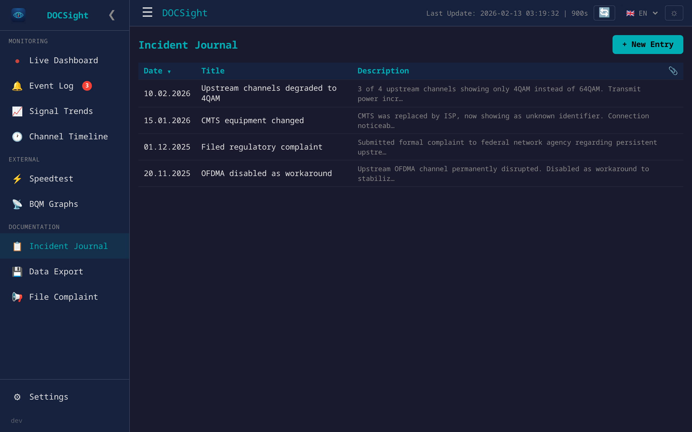
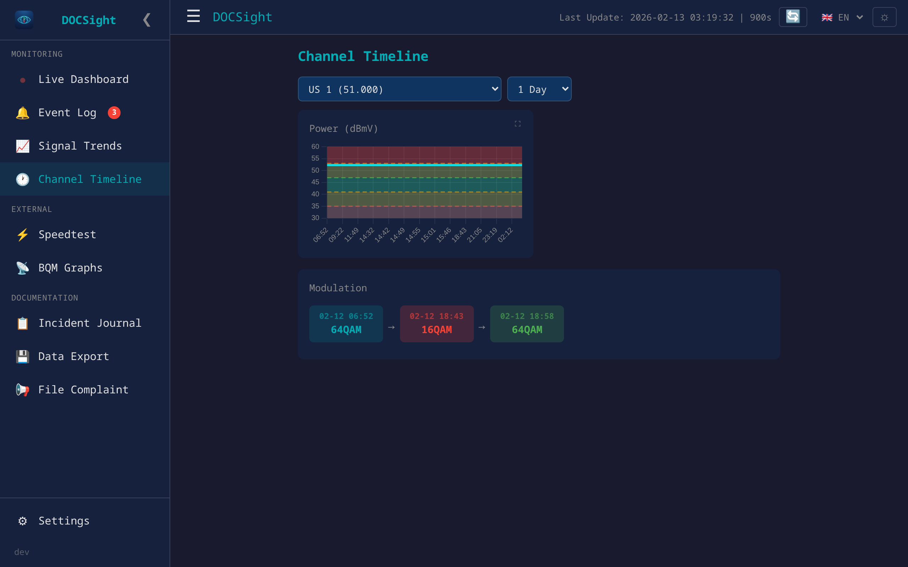
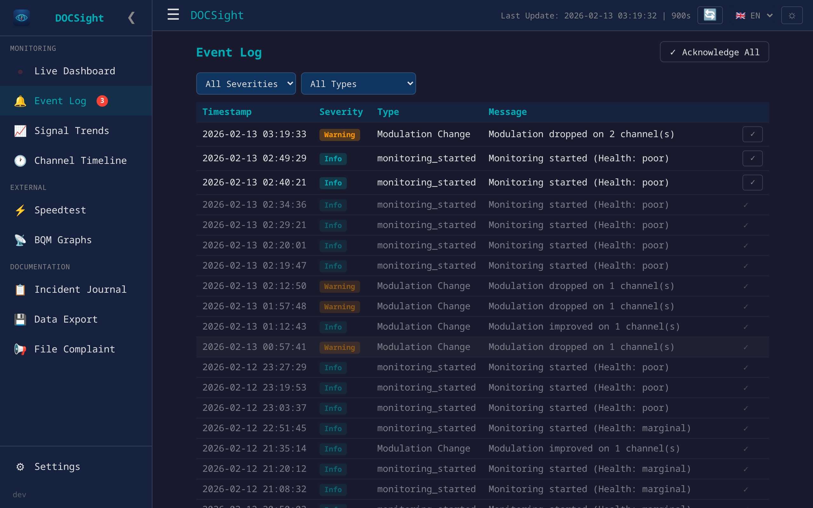

<p align="center">
  
</p>

<h1 align="center">DOCSight</h1>

<p align="center">
  <a href="LICENSE"></a>
  <a href="https://github.com/itsDNNS/docsight/pkgs/container/docsight"></a>
  <a href="https://ko-fi.com/itsdnns"></a>
  <a href="https://github.com/itsDNNS/docsight/stargazers"></a>
</p>

<p align="center">
  <strong>Your cable internet is slow and your provider says everything is fine?<br>DOCSight proves them wrong.</strong>
</p>

<p align="center">
  DOCSight monitors your cable internet connection 24/7 and collects the hard evidence you need to hold your ISP accountable. One click generates a complaint letter with real data your provider can't ignore.
</p>

<p align="center">
  <em>For cable internet (DOCSIS/coax) only — Vodafone Kabel, Pyur, Tele Columbus, Virgin Media, Comcast, Spectrum, and others.</em>
</p>


---

## Quick Start

```bash
docker run -d --name docsight -p 8765:8765 -v docsight_data:/data ghcr.io/itsdnns/docsight:latest
```

Open `http://localhost:8765`, enter your router login, done. [Full installation guide →](https://github.com/itsDNNS/docsight/wiki/Installation)

---

## Is This For Me?

| | |
|---|---|
| ✅ You have **cable internet** (coax/DOCSIS) | DOCSight is built for this |
| ✅ Your internet **drops out or is slower** than what you're paying for | DOCSight documents it |
| ✅ Your ISP says **"everything is fine on our end"** | DOCSight gives you proof |
| ❌ You have **DSL or fiber** | This tool won't work for you |

---

## Your Data Stays With You

| | |
|---|---|
| 🏠 **Runs 100% locally** | No cloud, no external servers |
| 🔒 **Nothing leaves your network** | Your data is never uploaded anywhere |
| 📖 **Open source** | All code is public and verifiable |
| 🔐 **Credentials encrypted** | Router login encrypted at rest (AES-128) |

---

## Features

| Feature | Description |
|---|---|
| **[Live Dashboard](https://github.com/itsDNNS/docsight/wiki/Features-Dashboard)** | Real-time channel data with health assessment and metric cards |
| **[Signal Trends](https://github.com/itsDNNS/docsight/wiki/Features-Signal-Trends)** | Interactive charts with DOCSIS reference zones (day/week/month) |
| **[Event Log](https://github.com/itsDNNS/docsight/wiki/Features-Event-Log)** | Automatic anomaly detection with modulation watchdog |
| **[Speedtest Integration](https://github.com/itsDNNS/docsight/wiki/Features-Speedtest)** | Speed test history from [Speedtest Tracker](https://github.com/alexjustesen/speedtest-tracker) |
| **[Incident Journal](https://github.com/itsDNNS/docsight/wiki/Features-Incident-Journal)** | Document ISP issues with attachments |
| **[Complaint Generator](https://github.com/itsDNNS/docsight/wiki/Filing-a-Complaint)** | Editable ISP letter + downloadable technical PDF |
| **Channel Timeline** | Per-channel power, SNR, error, and modulation history over time |
| **[Home Assistant](https://github.com/itsDNNS/docsight/wiki/Home-Assistant)** | MQTT Auto-Discovery with per-channel sensors |
| **[BQM Integration](https://github.com/itsDNNS/docsight/wiki/Features-BQM)** | ThinkBroadband broadband quality graphs |
| **[LLM Export](https://github.com/itsDNNS/docsight/wiki/Features-LLM-Export)** | Structured reports for AI analysis |

4 languages (EN/DE/FR/ES) · Light/Dark mode · Setup wizard · Optional authentication

---

## Screenshots

<details>
<summary>Click to expand</summary>

| Dashboard (Dark) | Dashboard (Light) |
|---|---|
|  |  |

| Signal Trends | Health Assessment |
|---|---|
|  |  |

| Speedtest Tracker | Incident Journal |
|---|---|
|  |  |

| Channel Timeline | Event Log |
|---|---|
|  |  |

</details>

---

## Supported Hardware

| | Status |
|---|---|
| **AVM Fritz!Box Cable** (6590, 6660, 6690) | ✅ Fully supported |
| **Vodafone Station** (Arris TG3442DE) | 🔜 Planned ([roadmap](https://github.com/itsDNNS/docsight/wiki/Roadmap)) |
| **Technicolor / Sagemcom** | 🔜 Planned |
| **Other DOCSIS modems** | Contributions welcome! See [Adding Modem Support](https://github.com/itsDNNS/docsight/wiki/Adding-Modem-Support) |

Works with any DOCSIS cable provider: Vodafone, Pyur/Tele Columbus, eazy, Magenta (AT), UPC (CH), Virgin Media (UK), and others. Default signal thresholds are based on VFKD guidelines and can be customized in `thresholds.json` for your ISP.

## Requirements

- Docker (or any OCI-compatible container runtime)
- A supported DOCSIS cable modem or router (see above)
- MQTT broker (optional, for Home Assistant)

## Documentation

📚 **[Wiki](https://github.com/itsDNNS/docsight/wiki)** — Full documentation, guides, and DOCSIS glossary

## Contributing

See [CONTRIBUTING.md](CONTRIBUTING.md). **Please open an issue before working on new features.**

## Roadmap

See the **[full roadmap](https://github.com/itsDNNS/docsight/wiki/Roadmap)** in the wiki.

## Changelog

See [GitHub Releases](https://github.com/itsDNNS/docsight/releases).

## Support

If DOCSight helps you, consider [buying me a coffee](https://ko-fi.com/itsdnns) ☕

## License

[MIT](LICENSE)
