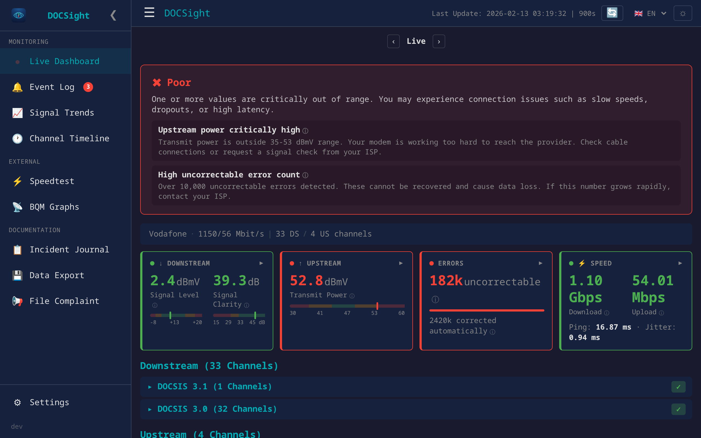
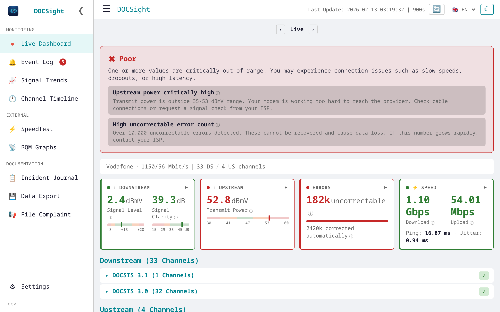
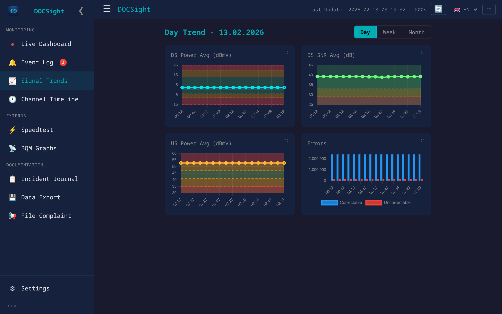
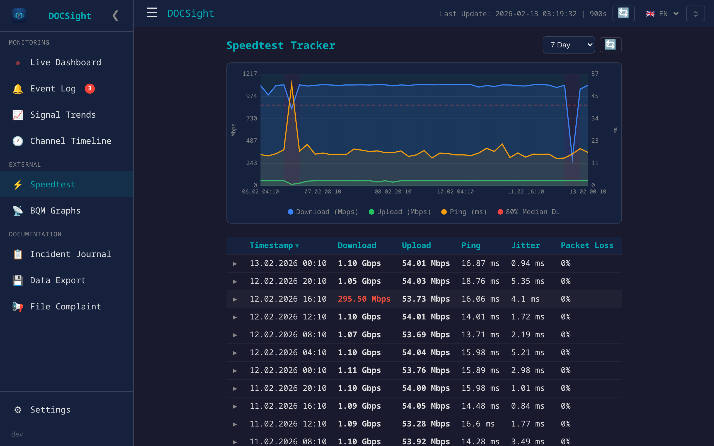
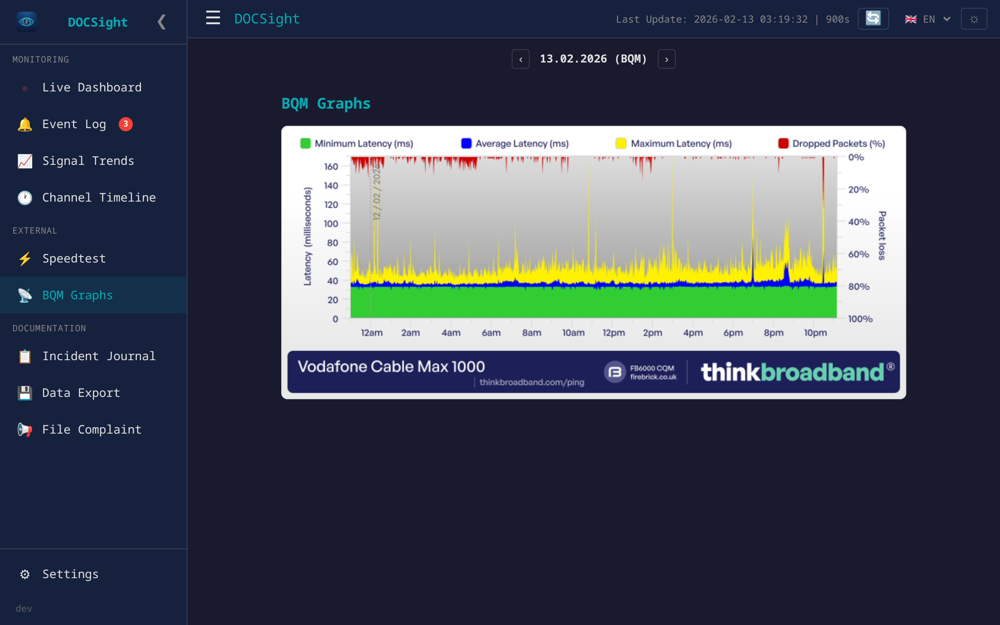

<p align="center">
  
</p>

<h1 align="center">DOCSight</h1>

<p align="center">
  <a href="LICENSE"></a>
  <a href="https://github.com/itsDNNS/docsight/pkgs/container/docsight"></a>
  <a href="https://github.com/itsDNNS/docsight/stargazers"></a>
</p>

<p align="center">
  <strong>Your cable internet is slow and your provider says everything is fine?<br>DOCSight proves them wrong.</strong>
</p>

<p align="center">
  DOCSight monitors your cable internet connection 24/7 and collects the hard evidence you need to hold your ISP accountable. One click generates a complaint letter with real data your provider can't ignore.
</p>

<p align="center">
  <em>For cable internet (DOCSIS/coax) only — Vodafone Kabel, Pyur, Tele Columbus, Virgin Media, Comcast, Spectrum, and others.</em>
</p>



---

## How It Works

**Step 1: Install** — Run one command to start DOCSight on your computer or NAS:

```bash
docker run -d --name docsight -p 8765:8765 -v docsight_data:/data ghcr.io/itsdnns/docsight:latest
```

> New to Docker? See the **[Installation Guide](INSTALL.md)** for step-by-step instructions (Windows, Mac, Linux, Synology NAS).

**Step 2: Connect your router** — Open `http://localhost:8765` in your browser. The setup wizard asks for your router login — that's it. Takes 2 minutes.

**Step 3: Sit back** — DOCSight monitors your connection around the clock. When something is wrong, you'll see it immediately — and you can generate a complaint letter backed by real data.

---

## Your Data Stays With You

| | |
|---|---|
| **Runs 100% locally** | No cloud, no external servers. DOCSight runs entirely on your own hardware. |
| **Nothing leaves your network** | Your data is never uploaded anywhere. Everything stays on your machine. |
| **Open source** | All code is public. Anyone can read it and verify exactly what it does. |
| **Credentials encrypted** | Your router login is encrypted at rest (AES-128) and never stored in plain text. |

---

## Is This For Me?

| | |
|---|---|
| ✅ You have **cable internet** (coax/DOCSIS) | DOCSight is built for this |
| ✅ Your internet **drops out or is slower** than what you're paying for | DOCSight documents it |
| ✅ Your ISP says **"everything is fine on our end"** | DOCSight gives you proof |
| ❌ You have **DSL or fiber** | This tool won't work for you |
| ✅ Your internet **works fine right now** | DOCSight builds a history — if problems start later, you already have proof of what "normal" looked like |

---

## Glossary — What Do These Numbers Mean?

The DOCSight dashboard shows technical measurements from your cable modem. Here's what they mean in plain language:

| Term | What it means |
|---|---|
| **DOCSIS** | The technology that makes cable internet work. Your internet signal travels through the same coaxial cable as TV. |
| **Downstream / Upstream** | Downstream = download direction (Netflix, browsing). Upstream = upload direction (video calls, sending files). |
| **SNR (Signal-to-Noise Ratio)** | How clear your signal is. Think of it like radio reception — high SNR means a clear signal, low SNR means static and interference. Measured in dB. |
| **Power Level** | How strong your signal is. Too weak or too strong and your internet suffers. Measured in dBmV. |
| **Uncorrectable Errors** | Data packets that were lost and couldn't be recovered. A few are normal, but many of these cause buffering, dropouts, and slow speeds. |
| **Correctable Errors** | Data packets that arrived damaged but were automatically repaired. Lots of these are a warning sign. |
| **QAM / Modulation** | How much data is packed into each signal. Higher QAM (like 256QAM or 4096QAM) means more speed. If your modem drops to a lower QAM, something is wrong with the signal. |
| **Channels** | Your cable connection uses many frequencies at once (like lanes on a highway). Each lane is a "channel." More healthy channels = more bandwidth. |

---

## Features

<details>
<summary><strong>Monitoring & Diagnostics</strong></summary>

- **Web Dashboard**: Real-time channel data with health assessment, metric cards, and calendar navigation
- **Health Assessment**: Automatic traffic-light evaluation with actionable recommendations
- **Signal Trends**: Interactive charts with DOCSIS reference zones (color-coded thresholds) for day/week/month views
- **Speedtest Tracker Integration**: Pull speed test results (download, upload, ping, jitter) from a self-hosted [Speedtest Tracker](https://github.com/alexjustesen/speedtest-tracker) instance with charts, sortable history, and anomaly highlighting
- **Incident Report**: Two-step complaint flow with editable ISP letter + downloadable technical PDF
- **LLM Export**: Generate structured reports for AI analysis (ChatGPT, Claude, Gemini, etc.)
- **ThinkBroadband BQM**: Daily fetch and archive of broadband quality graphs with gallery view

</details>

<details>
<summary><strong>Ease of Use</strong></summary>

- **Setup Wizard**: Browser-based configuration — no .env file needed
- **4 Languages**: English, German, French, and Spanish UI (181+ translation keys each)
- **Light/Dark Mode**: Persistent theme toggle
- **URL Hash Routing**: Bookmark and share specific views (#trends, #speedtest, #bqm)
- **Zero JavaScript Dependencies**: All charts are pure HTML5 Canvas — no Chart.js, no libraries
- **Optional Authentication**: Password-protected web UI with scrypt hashing

</details>

<details>
<summary><strong>Smart Home Integration</strong> (optional)</summary>

- **MQTT Auto-Discovery**: Zero-config integration with Home Assistant
- **Per-Channel + Summary Sensors**: Every DOCSIS channel and aggregated metrics as HA entities

</details>

<details>
<summary><h2>Configuration</h2></summary>

Configuration is stored in `config.json` inside the Docker volume and persists across restarts. Environment variables override config.json values.

### Via Web UI (recommended)

1. Start the container - the setup wizard opens automatically
2. Enter your modem URL, username, and password - test the connection
3. Optionally configure MQTT broker for Home Assistant integration
4. Set poll interval, history retention, and language
5. Done - monitoring starts immediately

Access `/settings` at any time to change configuration, set an admin password, or toggle light/dark mode.

### Via Environment Variables (optional)

Copy `.env.example` to `.env` and edit:

| Variable | Default | Description |
|---|---|---|
| `MODEM_URL` | `http://192.168.178.1` | Modem URL |
| `MODEM_USER` | - | Modem username |
| `MODEM_PASSWORD` | - | Modem password |
| `MQTT_HOST` | - | MQTT broker host (optional) |
| `MQTT_PORT` | `1883` | MQTT broker port |
| `MQTT_USER` | - | MQTT username (optional) |
| `MQTT_PASSWORD` | - | MQTT password (optional) |
| `MQTT_TOPIC_PREFIX` | `docsight` | MQTT topic prefix |
| `POLL_INTERVAL` | `900` | Polling interval in seconds |
| `WEB_PORT` | `8765` | Web UI port |
| `HISTORY_DAYS` | `0` | Snapshot retention in days (0 = unlimited) |
| `ADMIN_PASSWORD` | - | Web UI password (optional) |
| `BQM_URL` | - | ThinkBroadband BQM share URL (.png, optional) |
| `SPEEDTEST_TRACKER_URL` | - | Speedtest Tracker URL (optional) |
| `SPEEDTEST_TRACKER_TOKEN` | - | Speedtest Tracker API token (optional) |

</details>

<details>
<summary><h2>Screenshots</h2></summary>

| Dashboard (Dark) | Dashboard (Light) |
|---|---|
|  |  |

| Signal Trends | Health Assessment |
|---|---|
|  |  |

| Speedtest Tracker | BQM Gallery |
|---|---|
|  |  |

</details>

<details>
<summary><h2>Home Assistant Integration</h2></summary>

DOCSight can optionally publish all channel data to Home Assistant via MQTT Auto-Discovery. This is not required to use DOCSight.

### Per-Channel (~37 DS + 4 US)

- `sensor.docsight_ds_ch{id}` - State: Power (dBmV), Attributes: frequency, modulation, snr, errors, docsis_version, health
- `sensor.docsight_us_ch{id}` - State: Power (dBmV), Attributes: frequency, modulation, multiplex, docsis_version, health

### Summary (14)

| Sensor | Unit | Description |
|---|---|---|
| `docsight_health` | - | Overall health (good/marginal/poor) |
| `docsight_health_details` | - | Detail text |
| `docsight_ds_total` | - | Number of downstream channels |
| `docsight_ds_power_min/max/avg` | dBmV | Downstream power range |
| `docsight_ds_snr_min/avg` | dB | Downstream signal-to-noise |
| `docsight_ds_correctable_errors` | - | Total correctable errors |
| `docsight_ds_uncorrectable_errors` | - | Total uncorrectable errors |
| `docsight_us_total` | - | Number of upstream channels |
| `docsight_us_power_min/max/avg` | dBmV | Upstream power range |

</details>

<details>
<summary><h2>Reference Values</h2></summary>

| Metric | Good | Marginal | Poor |
|---|---|---|---|
| DS Power | -7..+7 dBmV | +/-7..+/-10 | > +/-10 dBmV |
| US Power | 35..49 dBmV | 50..54 | > 54 dBmV |
| SNR / MER | > 30 dB | 25..30 | < 25 dB |

</details>

## Requirements

- Docker (or any OCI-compatible container runtime)
- A DOCSIS cable modem or router with web interface (tested with AVM FRITZ!Box 6690 Cable)
- MQTT broker (optional) — only needed for Home Assistant integration

## Roadmap

### Modulation & Signal Intelligence
- [ ] **Modulation Watchdog**: Track and alert on QAM modulation changes per channel (e.g. 256QAM dropping to 16QAM) — the #1 symptom users report in cable forums
- [ ] **Channel Heatmap**: Visual grid of all channels color-coded by modulation quality — spot frequency-dependent issues at a glance
- [ ] **OFDMA Analysis**: Detect whether the modem uses a wide OFDMA block vs. many narrow SC-QAMs; flag subcarrier count fluctuations as potential ingress indicators; track OFDMA enable/disable impact
- [ ] **Adaptive Polling**: Automatically increase poll frequency (e.g. every 10-30s) when uncorrectable errors spike, to capture incidents in high resolution
- [ ] **Upstream Channel Count Monitoring**: Alert when upstream channels drop (e.g. from 5 to 1) — early indicator of return path issues
- [ ] **Ingress/Return Path Scoring**: Composite score based on upstream power levels, modulation quality, and channel count to detect return path interference before total failure

### Diagnosis & Reporting
- [x] **Incident Report Export**: Two-step flow — editable ISP complaint letter with customer data fields + downloadable technical PDF with channel tables, worst values, and DIN threshold references (EN/DE/FR/ES)
- [ ] **Incident Journal**: Built-in log to document ISP issues over time — date, title, detailed description, screenshot uploads. Replaces spreadsheet-based tracking and feeds directly into complaint letters and reports.
- [ ] **Ping Correlation**: Built-in latency monitor (ping to configurable targets) overlaid on error graphs to prove causality between physical layer issues and packet loss — replaces manual PingPlotter usage
- [ ] **Before/After Comparison**: Side-by-side overlay of two time periods (e.g. week before vs. after technician visit) to quantify improvements
- [ ] **FritzBox Event Log Parser**: Extract and display T3/T4 Timeout events, Ranging Request failures, and other DOCSIS error codes from the modem's event log
- [ ] **Plain-Language Explanations**: "What does this mean?" tooltips translating technical values into actionable advice (e.g. "Your upstream power is critically high — this means the signal has to travel too far or passes through damaged cable")

### Alerting & Notifications
- [ ] **Notification System**: Configurable alerts via webhook, Telegram, Discord, email, or Gotify/ntfy on health degradation, modulation drops, or connectivity loss
- [ ] **Power Level Drift Detection**: Alert on relative changes (e.g. +3 dB in 24h) in addition to absolute thresholds — catch creeping degradation before it causes outages
- [ ] **Scheduled Health Digest**: Daily/weekly summary email or message with connection quality score, error trends, and notable events
- [ ] **Gaming/Real-Time Quality Index**: Dedicated score for latency-sensitive applications based on jitter, packet loss bursts, and modulation stability

### External Monitoring Integration
- [x] **ThinkBroadband BQM**: Daily fetch and archive of external broadband quality graphs (latency, packet loss)
- [x] **Speedtest Tracker**: Pull speed test results from self-hosted [Speedtest Tracker](https://github.com/alexjustesen/speedtest-tracker) with interactive charts, sortable history, anomaly highlighting, and incremental SQLite caching
- [ ] **Smokeping Integration**: Import or display Smokeping latency data alongside DOCSIS metrics for end-to-end correlation

### Enhanced Dashboard
- [ ] **Update Changelog Splash**: Show a "What's New" dialog on first login after a version update — highlights new features and changes so users stay informed without reading GitHub Releases
- [ ] Combined timeline: DOCSIS health + speed tests + BQM graph + ping data on a single time axis
- [ ] Mobile-responsive layout
- [ ] Segment load indicator: Visualize peak-hour degradation patterns (e.g. 20:00-23:00 slowdowns)
- [ ] Network uptime calendar: Month-view heatmap showing daily connection quality at a glance
- [ ] Power level drift detection: Alert on relative changes (e.g. +3 dB in 24h) in addition to absolute thresholds
- [x] Manual poll buttons: Trigger FritzBox and Speedtest Tracker data refresh on demand

### Multi-Modem Support
- [ ] Plugin architecture for modem drivers
- [ ] **Vodafone Station / CommScope driver**: Support for the most common ISP-provided cable modem in Germany
- [ ] **Arris / Technicolor / Sagemcom drivers**: Cover the long tail of ISP-provided hardware
- [ ] SNMP-based generic driver for additional cable modem models
- [ ] Community-contributed drivers with documentation template

## Contributing

See [CONTRIBUTING.md](CONTRIBUTING.md) for development setup and guidelines.

## Changelog

See [GitHub Releases](https://github.com/itsDNNS/docsight/releases) for release notes and changelogs.

## License

[MIT](LICENSE)
